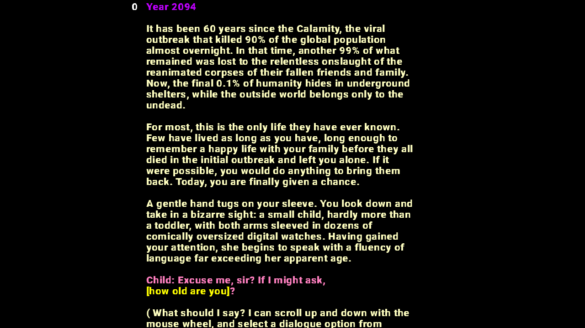

# Crisis Averted

Author: Greg Loose

Design: Crisis Averted is a text-based adventure game about going back in time to prevent the apocalypse. Use your knowledge of the future to change the past and earn one of four different endings (one of which isn't a joke).

Text Drawing: At game startup time, I create the font (Roboto, from https://fonts.google.com/specimen/Roboto) using freetype, then create a tile map similar to the one used in Game 1. Each "tile" corresponds to a single character from ' ' to '~' on the ASCII table. I get the glyph bitmaps from Freetype and draw them into the tile map. The tile map is then loaded into OpenGL using glTexImage2D. At run time, whenever I draw text, I shape it using Harfbuzz (ignoring ligatures, as these created complications with my tile map structure and I found that they weren't all that important aesthetically). After shaping, I iterate through the characters, adding to a running position that is incremented based on the advance property. For each character, I add a quad with degenerate corners to a triangle strip vertex array, which stores positions, coordinates into the tile map, and base color. I borrowed several structs from PPU466.cpp to support this process, though I had to modify them to include the base color property, which was my own addition. The fragment shader gets its alpha value from the tile map texture and its RGB values from the base color in order to create text of different colors. My drawText function also supports line wrapping, which is not available in Harfbuzz by default. It reads ahead at each space character and moves to the next line if the x position exceeds a given width parameter before the next space is found. It also recognizes substrings contained within square brackets, which represent choices in my game, and draws them in a different color.

Choices: I write each "state" in a separate text file. A state consists of an arbitrary number of lines of text, followed by a line of dashes, followed by a state footer including transitions to other states.

Text lines are written in standard ASCII text, with blank lines ignored. An asterisk may be used at the start of a line to indicate that it is spoken; in such cases, the game code attempts to match the substring between the asterisk and the first colon character to a set of known character names, and the line is color coded to that character during text rendering. As mentioned earlier, text in square brackets is interpreted as a choice trigger. All of this parsing occurs during my asset pipeline.

Transitions are written in the following form:

[trigger] new_state

Each transition line in the footer is loaded into a transition object in the asset pipeline. When the player clicks on a section of square-bracketed text matching the trigger while in the current state, it causes a transition to the new state, whose name matches some state file containing all of this data generated by the asset pipeline.

I initially began writing my asset pipeline to support more complex transitions which would support a form of linear logic (or at least, my understanding of linear logic before the linear logic lecture), but this turned out to be unnecessary, as the player's progression through the game is not based on the gathering of resources, but on discovering more dialogue and thereby unlocking more choices of triggers to click in the story log.

Screen Shot:

How To Play:

Controls:

Mouse wheel: scroll up and down in one timeline

A and D: view the timeline to the left or right

Crisis Averted is a text-based game where player progression is based on discovering "choices" through the story that can be reused later. These choices may come in the form of conversation topics to ask questions about, instructions to act upon, or other clues that might help you reach the good ending, and can be used by clicking on any string of bright yellow text in square brackets. Not all choices can be used in every situation, but (usually) there's no harm in just clicking on one to try it out. The game features one good ending and three bad/joke endings which you can earn based on your choices.

You can often choose to travel back in time, which creates a new parallel timeline. Try to reach the good ending using as few timelines as possible!

Sources: https://fonts.google.com/specimen/Roboto

This game was built with [NEST](NEST.md).

